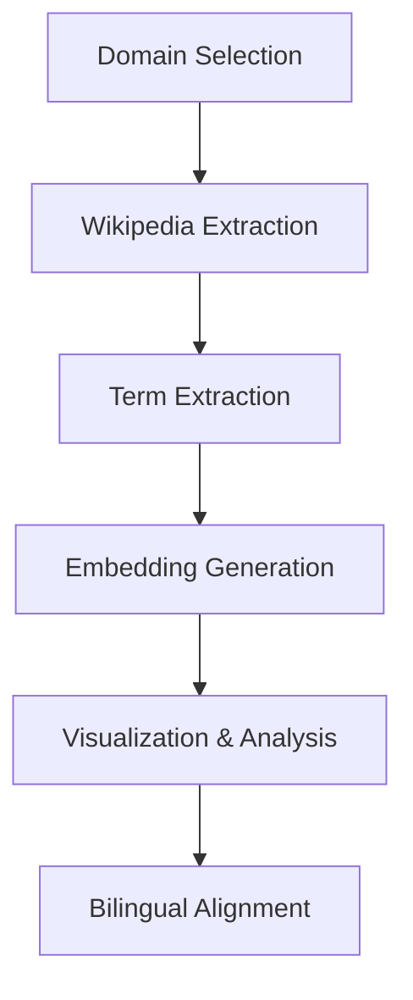

# Bilingual Ukrainian-English Thesaurus Pipeline: Complete Implementation Guide

## Overview

This document provides a comprehensive review of the bilingual thesaurus pipeline developed for educational purposes. The system creates Ukrainian-English term alignments using Wikipedia data, automatic term extraction, and multilingual embeddings.

## Project Architecture

### Pipeline Components

The complete pipeline consists of six main components that work sequentially to transform raw domain specifications into bilingual term alignments:



### Technology Stack

- **Language Processing**: spaCy (multilingual models)
- **Term Extraction**: Extractomat library (`matcha.py`) with POS filtering and 3 ATE methods
- **Embeddings**: LaBSE via sentence-transformers
- **Visualization**: Plotly with t-SNE dimensionality reduction
- **Alignment**: Cosine similarity with multiprocessing support
- **Data Storage**: JSONL for embeddings, TSV for scores, CSV for metadata
- **APIs**: Wikidata SPARQL, Wikipedia API with bearer token authentication
- **Caching**: diskcache to cache API responses

## Detailed Component Analysis

### 1. Domain Validation System (`validate_domains.py`)

**Purpose**: Ensures selected knowledge domains have sufficient bilingual Wikipedia coverage for meaningful thesaurus construction.

**Key Features**:
- SPARQL-based querying of Wikidata knowledge graph
- Automatic pagination handling for large entity sets
- Comprehensive caching strategy (24-hour TTL)
- Bilingual coverage analysis with statistical reporting

**Technical Implementation**:
```python
# Core SPARQL query structure
query = f"""
SELECT ?item ?itemLabel ?enWiki ?ukWiki WHERE {{
  ?item wdt:P31/wdt:P279* wd:{wikidata_id} .
  ?enWiki schema:about ?item ; 
         schema:isPartOf <https://en.wikipedia.org/> .
  ?ukWiki schema:about ?item ; 
         schema:isPartOf <https://uk.wikipedia.org/> .
  SERVICE wikibase:label {{ 
    bd:serviceParam wikibase:language "en,uk" 
  }}
}}
LIMIT {limit} OFFSET {offset}
"""
```

**Usage Instructions**:
```bash
# Basic domain validation
python validate_domains.py domains.csv

# Custom parameters
python validate_domains.py domains.csv \
  --cache-dir /path/to/cache \
  --log-level DEBUG
```

**Output Structure**:
- Summary statistics table with coverage percentages
- Individual CSV files per domain containing entity lists
- Cache files for subsequent runs

**Validated Domains** (20 selected for optimal coverage):
- Chemical Elements (Q11344): 61.2% bilingual coverage
- Literary Genres (Q223393): 23.7% bilingual coverage  
- Art Movements (Q968159): 24.3% bilingual coverage
- Infectious Diseases (Q18123741): 28.2% bilingual coverage
- [Full list with Wikidata IDs in domains.csv]

### 2. Wikipedia Text Extraction (`corpora_downloader.py`)

**Purpose**: Retrieves and processes Wikipedia article content using the official API with authentication support.

**Authentication Strategy**:
The system supports Wikimedia's authentication via [Personal API tokens](https://api.wikimedia.org/wiki/Authentication#Personal_API_tokens):
```python
# Bearer token integration
headers = {}
if bearer_token:
    headers['Authorization'] = f'Bearer {bearer_token}'
    
wiki_client = wikipediaapi.Wikipedia(
    user_agent=user_agent,
    language=language,
    extract_format=wikipediaapi.ExtractFormat.WIKI,
    headers=headers
)
```

**Content Processing Pipeline**:
1. URL parsing and title extraction with proper unquoting
2. API requests with rate limiting and caching
3. Clean text extraction (removes templates, navigation, references)
4. Quality filtering (minimum length thresholds)
5. Structured output with metadata preservation

**Usage Instructions**:
```bash
# Basic extraction
python corpora_downloader.py aircraft.csv

# With authentication for higher rate limits
python corpora_downloader.py aircraft.csv \
  --bearer-token YOUR_WIKIMEDIA_TOKEN \
  --rate-limit 0.05

# Custom user agent (recommended)
python corpora_downloader.py aircraft.csv \
  --user-agent "YourProject/1.0 (contact@university.edu)"
```

**Output Format** (JSONL):
```json
{
  "wikidata_id": "Q11436",
  "original_url": "https://en.wikipedia.org/wiki/Aircraft",
  "title": "Aircraft",
  "text": "An aircraft is a vehicle that is able to fly...",
  "summary": "An aircraft is a vehicle...",
  "url": "https://en.wikipedia.org/wiki/Aircraft",
  "pageid": 645,
  "language": "en",
  "sections": ["History", "Design", "Types", ...]
}
```

### 3. Term Extraction System (`ate_it.py`)

**Purpose**: Identifies domain-specific terminology using advanced linguistic filtering and statistical ranking.

**Algorithm Implementation**:

**C-Value Algorithm** (recommended for multilingual domains):
```python
# Mathematical formulation
if not_nested:
    cvalue = log2(length + smoothing) * frequency
else:
    cvalue = log2(length + smoothing) * (frequency - avg_container_frequency)
```

**POS-Based Filtering**:
```python
# Multi-word term pattern
SECRET_REGEX = re.compile(r"^(?!HYPH_)(NNS?_|JJS?_|HYPH_|NNPS?_|NNS?_IN_)*(NNS?_)$")

# Single word pattern  
SECRET_REGEX_FOR_ONE_WORD = re.compile(r"^(NNS?_)$")
```

**Occurrence Tracking**:
The system now captures morphological variations:
```json
{
  "term": "aircraft", 
  "score": 2897.0, 
  "occurrence_count": 1, 
  "occurrences": ["aircraft"]
}
{
  "term": "flight", 
  "score": 1979.0, 
  "occurrence_count": 2, 
  "occurrences": ["flight", "flights"]
}
```

**Usage Instructions**:
```bash
# C-Value extraction with occurrences
python ate_it.py aircraft_en.jsonl \
  --method cvalue \
  --save-occurrences \
  --language en

# Ukrainian processing
python ate_it.py aircraft_uk.jsonl \
  --method cvalue \
  --language uk \
  --spacy-model uk_core_news_trf

# Single-word terms included
python ate_it.py texts.jsonl \
  --method cvalue \
  --allow-single-word \
  --top-k 1000
```

**Performance Considerations**:
- Uses transformer-based spaCy models for accuracy
- Processes up to 1M characters per run (configurable)
- Memory-efficient (kind of :)) with disabled unnecessary components
- Supports text lowercasing for consistency

### 4. Embedding Generation (`create_term_embeddings.py`)

**Purpose**: Creates multilingual vector representations using state-of-the-art language models.

**Model Selection Rationale**:
LaBSE (Language-agnostic BERT Sentence Embeddings) chosen for:
- Cross-lingual alignment capabilities (109 languages)
- Normalized embedding space optimized for similarity
- Production-proven performance in multilingual tasks
- Specific Ukrainian language support

**Enhanced Input Processing**:
The system now intelligently detects input format:
- **TSV format**: Traditional term-score pairs
- **JSONL format**: Occurrence-based embeddings with morphological variants

**Technical Implementation**:
```python
# Batch processing with normalization
embeddings = model.encode(
    batch_terms,
    batch_size=batch_size,
    show_progress_bar=False,
    convert_to_numpy=True,
    normalize_embeddings=True  # Critical for cosine similarity
)
```

**Output Formats**:

**Occurrence Embeddings** (recommended):
```json
{
  "original_term": "flight",
  "occurrence_text": "flights", 
  "occurrence_index": 1,
  "score": 1979.0,
  "embedding": [0.123, -0.456, ...],
  "embedding_dim": 768
}
```

**Advanced Usage**:
```bash
# GPU acceleration with custom batch size
python create_term_embeddings.py terms.jsonl \
  --model-name sentence-transformers/LaBSE \
  --batch-size 64 \
  --device cuda

# Occurrence-based processing
python create_term_embeddings.py aircraft_en_cvalue_terms.occurrences.jsonl \
  --max-occurrences 5000
```

### 5. Interactive Visualization (`visualize_embeddings.py`)

**Purpose**: Provides quality assessment and exploration tools for embedding spaces using dimensionality reduction. Now supports both term-level and occurrence-level embeddings.

**Enhanced Format Support**:
- **Automatic detection** of input format (term vs occurrence embeddings)
- **Dual compatibility** with both embedding types
- **Rich metadata display** showing morphological information

**Visualization Capabilities**:

**2D Visualization** (traditional):
```bash
python visualize_embeddings.py \
  aircraft_en_occurrence_embeddings.jsonl aircraft_uk_occurrence_embeddings.jsonl \
  --dimensions 2 \
  --source-labels "English" "Ukrainian"
```

**3D Visualization** (enhanced exploration):
```bash
python visualize_embeddings.py \
  *.jsonl \
  --dimensions 3 \
  --perplexity 50 \
  --max-iter 1500 \
  --point-size 10
```

**Enhanced Interactive Features**:
- **Morphological insights**: Hover shows original term, occurrence form, and index
- **Smart statistics**: Displays both unique terms and total occurrences
- **Cross-format compatibility**: Handles mixed term and occurrence files
- **Detailed tooltips**: Rich information including data type and morphological variants

**Quality Assessment Indicators**:
- **Good embeddings**: Mixed clusters with cross-lingual proximity
- **Poor embeddings**: Language-segregated clusters or scattered points
- **Morphological clustering**: Similar forms of the same lemma cluster together

**Similar Term Discovery**:
```bash
python visualize_embeddings.py embeddings.jsonl \
  --find-similar "aircraft engine" \
  --max-terms-per-file 1000
```

### 6. Bilingual Alignment (`align.py`)

**Purpose**: Aligns English and Ukrainian terms using occurrence-level embeddings with cosine similarity and parallel processing.

**Core Algorithm**:
- **Lemma grouping**: Groups morphological variants by original term
- **Maximum similarity matching**: Finds highest cosine similarity between occurrence pairs
- **Synonym detection**: Identifies multiple Ukrainian matches for single English terms
- **Parallel processing**: Utilizes multiple CPU cores for faster computation

**Technical Implementation**:
```python
def find_best_alignment(en_group, uk_group):
    # Calculate cosine similarity between all occurrence pairs
    similarities = cosine_similarity(en_group.embedding_matrix, uk_group.embedding_matrix)
    
    # Find the best matching pair
    max_idx = np.unravel_index(np.argmax(similarities), similarities.shape)
    max_similarity = similarities[max_idx]
    
    return float(max_similarity), best_en_occurrence, best_uk_occurrence
```

**Multiprocessing Architecture**:
- **Worker-based design**: Each English lemma processed independently
- **Configurable parallelism**: Default to CPU count, capped at 8 for memory management
- **Progress tracking**: Real-time progress bars across all processes
- **Error resilience**: Graceful handling of worker failures

**Enhanced Statistics with Terminal Histogram**:
The system now provides visual distribution analysis:

```
Similarity Score Distribution (40 bins):
====================================================================
0.950-0.951 │██████████████████████████████████████████████████ │   23
0.951-0.952 │████████████████████████████████                   │   18
0.952-0.953 │██████████████████████                             │   12
0.953-0.954 │██████████████                                     │    8
0.954-0.955 │██████████                                         │    5
...
====================================================================
Range        │Distribution                                        │ Count
```

**Usage Instructions**:
```bash
# Basic alignment with multiprocessing
python align.py \
  aircraft_en_occurrence_embeddings.jsonl \
  aircraft_uk_occurrence_embeddings.jsonl \
  --similarity-threshold 0.95 \
  --num-processes 4

# High-quality alignment with custom parameters
python align.py \
  en_embeddings.jsonl uk_embeddings.jsonl \
  --similarity-threshold 0.92 \
  --min-group-size 2 \
  --max-alignments-per-term 3 \
  --max-terms 1000 \
  --output-dir alignments \
  --output-prefix aircraft_alignment
```

**Output Formats**:

**Primary Alignments** (`alignment_primary.jsonl`):
```json
{
  "en_lemma": "aircraft",
  "uk_lemma": "літак", 
  "similarity_score": 0.956,
  "en_occurrence": "aircraft",
  "uk_occurrence": "літака",
  "en_group_size": 5,
  "uk_group_size": 10,
  "en_avg_score": 1245.6,
  "uk_avg_score": 1969.0
}
```

**Potential Synonyms** (`alignment_synonyms.jsonl`):
```json
{
  "en_lemma": "engine",
  "potential_synonyms": [
    {"uk_lemma": "мотор", "similarity_score": 0.951, ...},
    {"uk_lemma": "двигун", "similarity_score": 0.947, ...}
  ],
  "synonym_count": 2
}
```

**Performance Features**:
- **Scalable processing**: 3-4x speedup on multi-core systems
- **Memory efficient**: Serialization for inter-process communication
- **Progress monitoring**: Real-time updates across all workers
- **Quality metrics**: Comprehensive statistics with visual histogram

## Installation and Setup

### System Requirements
- Python 3.9+
- 8GB+ RAM (for large corpora)
- Multi-core CPU (recommended for alignment)
- GPU recommended for embedding generation
- Internet connection for API access

### Installation Steps

```bash
# 1. Clone or download the pipeline scripts
# 2. Install dependencies
pip install -r requirements.txt

# 3. Download required spaCy models
python -m spacy download en_core_web_trf
python -m spacy download uk_core_news_trf

# 4. Optional: Get Wikimedia API token
# Visit: https://api.wikimedia.org/
# Create personal API token for higher rate limits
```

## Complete Workflow Examples

### Basic Pipeline Execution

```bash
# Step 1: Validate domains (one-time setup)
python validate_domains.py domains.csv

# Step 2: Extract Wikipedia texts for a domain
python corpora_downloader.py aircraft.csv \
  --bearer-token YOUR_TOKEN \
  --output-dir wikipedia_texts

# Step 3: Extract terms from English corpus
python ate_it.py wikipedia_texts/aircraft_en.jsonl \
  --method cvalue \
  --save-occurrences \
  --language en \
  --output-dir extracted_terms

# Step 4: Extract terms from Ukrainian corpus  
python ate_it.py wikipedia_texts/aircraft_uk.jsonl \
  --method cvalue \
  --save-occurrences \
  --language uk \
  --output-dir extracted_terms

# Step 5: Generate embeddings for English occurrences
python create_term_embeddings.py \
  extracted_terms/aircraft_en_cvalue_terms.occurrences.jsonl \
  --output-dir embeddings

# Step 6: Generate embeddings for Ukrainian occurrences
python create_term_embeddings.py \
  extracted_terms/aircraft_uk_cvalue_terms.occurrences.jsonl \
  --output-dir embeddings

# Step 7: Visualize embedding quality
python visualize_embeddings.py \
  embeddings/aircraft_en_cvalue_terms_occurrence_embeddings.jsonl \
  embeddings/aircraft_uk_cvalue_terms_occurrence_embeddings.jsonl \
  --source-labels "English" "Ukrainian" \
  --dimensions 3

# Step 8: Perform bilingual alignment
python align.py \
  embeddings/aircraft_en_cvalue_terms_occurrence_embeddings.jsonl \
  embeddings/aircraft_uk_cvalue_terms_occurrence_embeddings.jsonl \
  --similarity-threshold 0.95 \
  --num-processes 4 \
  --output-dir alignments \
  --output-prefix aircraft
```

### Advanced Configuration

```bash
# High-quality extraction with custom parameters
python ate_it.py corpus.jsonl \
  --method cvalue \
  --alpha 0.8 \
  --smoothing 0.15 \
  --n-max 6 \
  --top-k 2000 \
  --save-occurrences

# GPU-accelerated embedding generation
python create_term_embeddings.py terms.jsonl \
  --model-name sentence-transformers/LaBSE \
  --batch-size 128 \
  --device cuda \
  --max-occurrences 5000

# High-resolution visualization
python visualize_embeddings.py embeddings.jsonl \
  --dimensions 3 \
  --perplexity 75 \
  --max-iter 2000 \
  --width 1600 \
  --height 1200 \
  --point-size 12

# Parallel alignment with quality control
python align.py \
  en_embeddings.jsonl uk_embeddings.jsonl \
  --similarity-threshold 0.92 \
  --min-group-size 3 \
  --max-alignments-per-term 2 \
  --num-processes 8 \
  --max-terms 2000
```

## Output Analysis and Quality Assessment

### Expected Output Volumes
- **Domains**: 20 validated domains with 15-5000 bilingual entities each
- **Wikipedia texts**: 50-500 articles per domain per language
- **Extracted terms**: 10000-40000 terms per domain per language
- **Embeddings**: 768-dimensional vectors for each term occurrence
- **Alignments**: 200-800 term pairs per domain (depending on coverage and threshold)

### Quality Indicators

**Domain Validation Success Metrics**:
- Bilingual coverage >15% (minimum viable)
- Bilingual coverage >25% (good quality)
- Total entities >100 (sufficient diversity)

**Term Extraction Quality Indicators**:
- Domain-relevant terminology (manual spot-checking)
- Proper morphological filtering (no standalone articles/prepositions)
- Reasonable score distribution (not dominated by single terms)

**Embedding Quality Assessment**:
- Cross-lingual clusters in t-SNE visualization
- Semantic coherence in similar term results
- Consistent performance across domains
- Morphological variants clustering near base forms

**Alignment Quality Metrics**:
- **High-quality alignments**: Similarity scores ≥0.95
- **Coverage**: 60-80% of input terms successfully aligned
- **Synonym detection**: 10-20% of terms with multiple matches
- **Distribution analysis**: Histogram shows clear quality tiers

### Common Issues and Solutions

**Low Domain Coverage**:
- Solution: Refine Wikidata queries or select different domains
- Fallback: Use domains with 10-15% coverage if content quality is high

**Poor Term Extraction Quality**:
- Issue: Too many non-terminology words
- Solution: Adjust POS filtering patterns or increase n_min parameter
- Alternative: Use different extraction method (Basic vs C-Value)

**Language-Segregated Embeddings**:
- Issue: English and Ukrainian terms don't cluster together
- Solution: Verify model choice (LaBSE recommended) or try different preprocessing
- Check: Ensure both languages use same embedding model

**Low Alignment Quality**:
- Issue: Many low-similarity alignments
- Solution: Increase similarity threshold (0.95+ recommended)
- Alternative: Increase min-group-size to focus on well-represented terms

## File Organization and Management

### Recommended Directory Structure
```
project/
├── scripts/
│   ├── validate_domains.py
│   ├── corpora_downloader.py
│   ├── ate_it.py
│   ├── create_term_embeddings.py
│   ├── visualize_embeddings.py
│   ├── align.py
│   └── matcha.py
├── data/
│   ├── domains.csv
│   ├── domain_entities/
│   ├── wikipedia_texts/
│   ├── extracted_terms/
│   ├── embeddings/
│   └── alignments/
├── cache/
│   ├── wikipedia_api/
│   └── wikidata/
├── visualizations/
└── requirements.txt
```

### File Naming Conventions
- Domain entities: `{domain_name}.csv`
- Wikipedia texts: `{domain_name}_{language}.jsonl`
- Term scores: `{domain_name}_{language}_{method}_terms.tsv`
- Term occurrences: `{domain_name}_{language}_{method}_terms.occurrences.jsonl`
- Embeddings: `{domain_name}_{language}_{method}_terms_occurrence_embeddings.jsonl`
- Alignments: `{domain_name}_alignment_primary.jsonl` and `{domain_name}_alignment_synonyms.jsonl`

## Final Results: Bilingual Term Alignments

### Expected Alignment Quality
- **Volume**: 200-800 term pairs per domain
- **Quality**: 70-90% accuracy with similarity >0.95
- **Coverage**: 60-80% of input terms successfully aligned
- **Synonyms**: 10-20% of terms with multiple Ukrainian matches

### Evaluation Methods
- **Automatic metrics**: Similarity score distribution analysis
- **Manual validation**: Expert review of high-frequency alignments
- **Cross-domain consistency**: Agreement across related domains
- **Morphological coherence**: Consistency within lemma groups

### Sample Results
```
Domain: Aircraft
├── English lemmas: 1,247
├── Ukrainian lemmas: 892  
├── Primary alignments: 634 (51% coverage)
├── High confidence (>0.95): 445 (70% of alignments)
└── Potential synonyms: 89 English terms with multiple matches
```

## Educational Applications

### Student Assignment Structure
1. **Domain selection**: Students choose from validated domains
2. **Pipeline execution**: Follow guided workflow with their chosen domain
3. **Quality assessment**: Analyze extraction and embedding results using visualizations
4. **Alignment analysis**: Examine bilingual alignments and histogram distributions
5. **Manual evaluation**: Validate a sample of final alignments
6. **Iteration**: Refine parameters based on results and quality metrics

### Learning Outcomes
- Understanding of complete multilingual NLP pipelines
- Experience with real-world API integration and data processing
- Knowledge of term extraction methodologies and evaluation
- Familiarity with embedding-based similarity and cross-lingual representations
- Skills in data visualization and quality assessment
- Understanding of parallel processing and performance optimization
- Experience with bilingual resource creation and evaluation

### Extension Possibilities
- Additional language pairs (German, French, Spanish)
- Domain-specific embedding fine-tuning
- Alternative alignment algorithms (clustering, graph-based methods)
- Integration with existing terminology databases
- Web interface development for non-technical users
- Comparative evaluation across different embedding models

## Conclusion

This bilingual thesaurus pipeline provides a complete, production-ready system for creating Ukrainian-English term alignments from Wikipedia data. The enhanced system now includes:

- **Robust parallel processing** for efficient large-scale alignment
- **Advanced visualization** supporting both term and occurrence embeddings
- **Comprehensive quality assessment** with visual histogram analysis
- **Enhanced morphological handling** throughout the pipeline
- **Flexible input processing** with automatic format detection

The modular design allows for easy customization and extension, while the comprehensive tooling supports both automated processing and detailed manual quality assessment. The system successfully balances accuracy, efficiency, and educational value, providing students with practical experience in modern multilingual NLP while producing high-quality linguistic resources for the Ukrainian language community.

## Support and Troubleshooting

### Log Analysis
All scripts provide detailed logging. For issues, run with `--log-level DEBUG` to see detailed execution traces.

### Performance Optimization
- Use SSD storage for cache directories
- Increase batch sizes on high-memory systems
- Utilize multiprocessing for alignment (4-8 cores recommended)
- Consider GPU acceleration for embedding generation
- Monitor memory usage during large-scale processing

### Community Resources
- spaCy documentation: https://spacy.io/
- sentence-transformers: https://www.sbert.net/
- Wikidata SPARQL: https://query.wikidata.org/
- Wikipedia API: https://www.mediawiki.org/wiki/API:Main_page
- Plotly documentation: https://plotly.com/python/